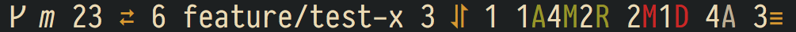
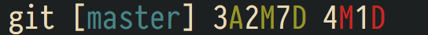

# gitline

gitline is a heads up display for git. It shows all relevant status information for a git repository in a compact and customizable way.
It can be used by shell prompts to display git information (eg. [slimfish](https://github.com/mgee/slimfish) and [slimline](https://github.com/mgee/slimline)).

Screenshot of gitline with a few changes to a git repository:


Screenshot of gitline with a lot of changes (work on a feature branch, changes on `origin/master`,
staged and unstaged modified files, untracked files, stashes, etc.):



## Table Of Contents

- [Requirements](#requirements)
- [Installation](#installation)
- [Options](#options)
    - [Format](#format)
        - [Colors](#colors)
        - [Placeholders](#placeholders)
    - [Repo Indicator](#repo-indicator)
    - [No Tracked Upstream](#no-tracked-upstream)
    - [Remote Commits](#remote-commits)
    - [Branch](#branch)
    - [Local Commits](#local-commits)
    - [Staged Changes](#staged-changes)
    - [Unstaged Changes](#unstaged-changes)
    - [Untracked](#untracked)
    - [Unmerged](#unmerged)
    - [Stashes](#stashes)
- [Example](#example)
- [Thanks](#thanks)
- [License](#license)

## Requirements

* python 2.6+

## Installation

Clone the repository and run the gitline script.
It is convenient to include it as a submodule eg. in a prompt theme.

## Options

gitline can be customized using a variety of environment variables.

### Format

These environment variable contain strings which contain placeholders
of the form `${...}`. These are replaced by gitline to display the git info.

#### Colors

Available colors are: `gray`, `red`, `green`, `yellow`, `blue`,
`magenta`, `cyan` and `white`. `reset` is used to reset the color to the default value.

#### Placeholders

| Placeholder              | Description                                                                  |
| ------------------------ | ---------------------------------------------------------------------------- |
| `action`                 | the current action (eg. bisect or cherry-pick)                               |
| `action_step`            | the current step of the action (eg. commit 3 of 5 which are rebased)         |
| `action_total`           | the total count of steps of the current action                               |
| `branch`                 | the current branch                                                           |
| `commit_hash`            | the shortform hash of HEAD                                                   |
| `commit_tag`             | the tag for the current commit                                               |
| `local_commits_to_pull`  | commits available to pull from the remote tracking branch                    |
| `local_commits_to_push`  | commits available to push from the remote tracking branch                    |
| `remote_commits_to_pull` | commits available to pull from `origin/master` to the remote tracking branch |
| `remote_commits_to_push` | commits available to push from `origin/master` to the remote tracking branch |
| `remote_tracking_branch` | the remote tracking branch                                                   |
| `remote`                 | the remote with the tracking branch                                          |
| `staged_added`           | number of staged added files                                                 |
| `staged_copied`          | number of staged copied files                                                |
| `staged_deleted`         | number of staged deleted files                                               |
| `staged_modified`        | number of staged modified files                                              |
| `staged_renamed`         | number of staged renamed files                                               |
| `stashes`                | number of stashes                                                            |
| `unmerged`               | number of unmerged files                                                     |
| `unstaged_deleted`       | number of unstaged deleted files                                             |
| `unstaged_modified`      | number of unstaged modified files                                            |
| `untracked`              | number of untracked files                                                    |

### Repo Indicator

#### `GITLINE_REPO_INDICATOR`

Defines the git repository indicator text.
Default is:
```shell
${reset}ᚴ
```

### Action

#### `GITLINE_ACTION`

Defines the format used to display if a git action _without_ step counts like eg. cherry-pick is currently performed.
Default is:
```shell
${yellow}${action}${reset}
```

#### `GITLINE_ACTION_STEPS`

Defines the format used to display if a git action _with_ step counts like eg. interactive rebase is currently performed.
Default is:
```shell
${yellow}${action}${reset} ${blue}${action_step}${reset}/${green}${action_total}${reset}
```

### No Tracked Upstream

#### `GITLINE_NO_TRACKED_UPSTREAM`

Defines the text which is displayed if the branch has no remote tracking branch.
Default is:
```shell
upstream ${red}⚡${reset}
```

### Remote Commits

#### `GITLINE_REMOTE_COMMITS_PUSH_PULL`

Defines the format used to display commits which can be pushed and pulled to/from `origin/master`.
Default is:
```shell
𝘮 ${remote_commits_to_pull} ${yellow}⇄${reset} ${remote_commits_to_push}
```

#### `GITLINE_REMOTE_COMMITS_PULL`

Defines the format used to display commits which can be pulled from `origin/master`.
Default is:
```shell
𝘮 ${red}→${reset}${remote_commits_to_pull}
```

#### `GITLINE_REMOTE_COMMITS_PUSH`

Defines the format used to display commits which can be pushed to `origin/master`.
Default is:
```shell
𝘮 ${green}←${reset}${remote_commits_to_push}
```

### Branch

#### `GITLINE_BRANCH`

Defines the format for the local branch.
Default is:
```shell
${branch}
```

#### `GITLINE_COMMIT_TAG`

Defines the format if a tag is checked out.
Default is:
```shell
${commit_tag}
```

#### `GITLINE_DETACHED`

Defines the format if the repository is not on a branch.
Default is:
```shell
${red}detached@${commit_hash}${reset}
```

### Local Commits

#### `GITLINE_LOCAL_COMMITS_PUSH_PULL`

Defines the format used to display commits which can be pushed and pulled to/from the remote tracking branch. 
Default is:
```shell
${local_commits_to_pull} ${yellow}⥯${reset} ${local_commits_to_push}
```

#### `GITLINE_LOCAL_COMMITS_PULL`

Defines the format used to display commits which can be pulled from the remote tracking branch.
Default is:
```shell
${local_commits_to_pull}${red}↓${reset}
```

#### `GITLINE_LOCAL_COMMITS_PUSH`

Defines the format used to display commits which can be pushed to the remote tracking branch.
Default is:
```shell
${local_commits_to_push}${green}↑${reset}
```

### Staged Changes

#### `GITLINE_STAGED_ADDED`

Defines the format used to display staged added files.
Default is:
```shell
${staged_added}${green}A${reset}
```

#### `GITLINE_STAGED_MODIFIED`

Defines the format used to display staged modified files.
Default is:
```shell
${staged_modified}${green}M${reset}
```

#### `GITLINE_STAGED_DELETED`

Defines the format used to display staged deleted files.
Default is:
```shell
${staged_deleted}${green}D${reset}
```

#### `GITLINE_STAGED_RENAMED`

Defines the format used to display staged renamed files.
Default is:
```shell
${staged_renamed}${green}R${reset}
```

#### `GITLINE_STAGED_COPIED`

Defines the format used to display staged copied files.
Default is:
```shell
${staged_copied}${green}C${reset}
```

### Unstaged Changes

#### `GITLINE_UNSTAGED_MODIFIED`

Defines the format used to display unstaged modified files.
Default is:
```shell
${unstaged_modified}${red}M${reset}
```

#### `GITLINE_UNSTAGED_DELETED`

Defines the format used to display unstaged deleted files.
Default is:
```shell
${unstaged_deleted}${red}D${reset}
```

### Untracked

#### `GITLINE_UNTRACKED`

Defines the format used to display untracked files.
Default is:
```shell
${untracked}${white}A${reset}
```

### Unmerged

#### `GITLINE_UNMERGED`

Defines the format used to display unmerged files.
Default is:
```shell
${unmerged}${yellow}U${reset}
```

### Stashes

#### `GITLINE_STASHES`

Defines the format used to display the number of stashes.
Default is:
```shell
${stashes}${yellow}≡${reset}
```

## Example

Here is an example for customizing the git repository indicator and branch format.
If you have a powerline compatible font you can also use the alternative repo indicator ``.

When using bash/zsh:
```shell
export GITLINE_REPO_INDICATOR='${reset}git'
export GITLINE_BRANCH='[${blue}${branch}${reset}]'
```

When using fish:
```shell
set -x GITLINE_REPO_INDICATOR '${reset}git'
set -x GITLINE_BRANCH '[${blue}${branch}${reset}]'
```

Screenshot:



## Users of gitline

- [slimfish](https://github.com/mgee/slimfish) a fish prompt theme
- [slimline](https://github.com/mgee/slimline) a zsh prompt theme

## Thanks

- [michaeldfallen/git-radar](https://github.com/michaeldfallen/git-radar)
- [gbataille/gitHUD](https://github.com/gbataille/gitHUD)

## License

Released under the [MIT License](LICENSE)
